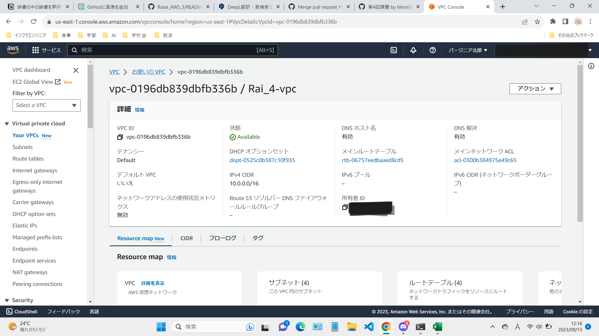
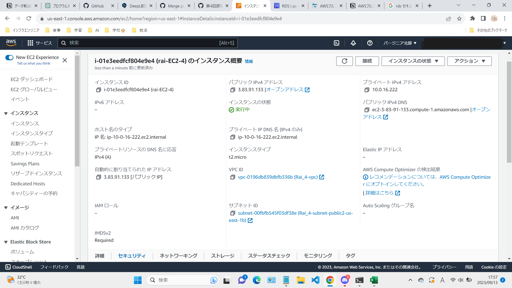
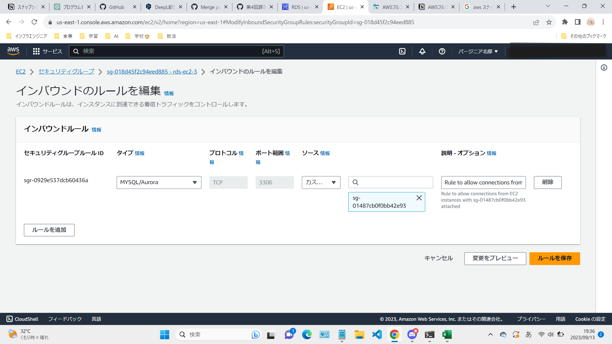

## VPC
### VPCの作成

## EC2
### EC2の作成

### EC2のセキュリティグループ
0.0.0.0/0はすべての通信を許可するネットワーク範囲なので、今回は自分のPCからのみアクセスが可能なネットワークに設定しました。

## RDS
### RDSの作成

### RDSのセキュリティグループ
RDSもEC2と同様にセキュリティ対策として、さきほど作成したEC2からのみアクセスが可能なようにネットワークを設定しました。

## EC2からRDSに接続
EC2から正常に接続されているのが確認できる。
